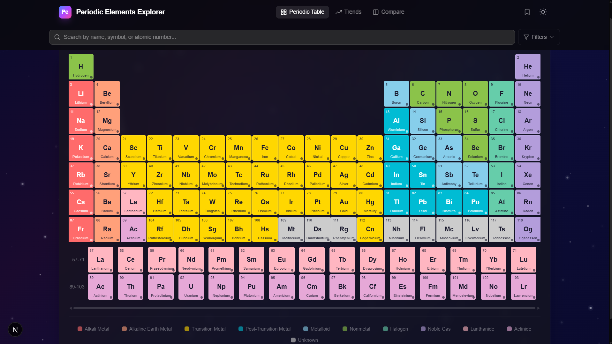
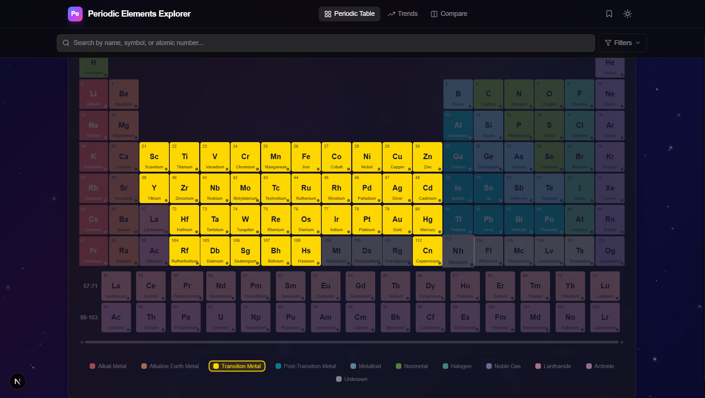
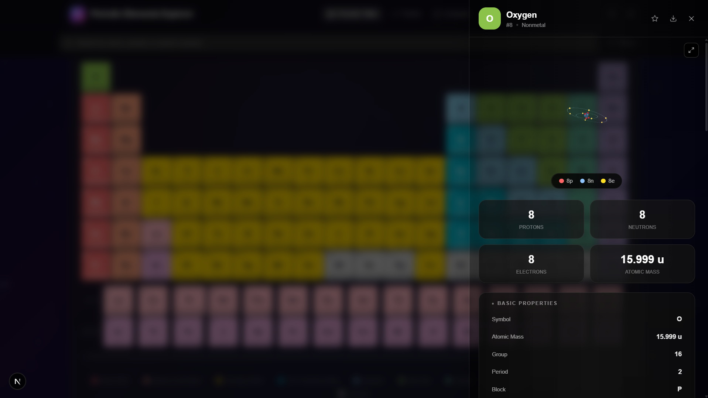
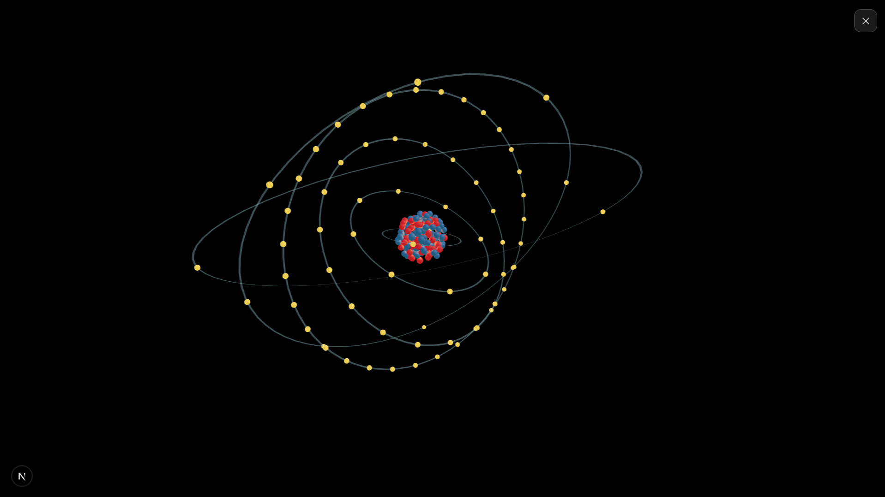
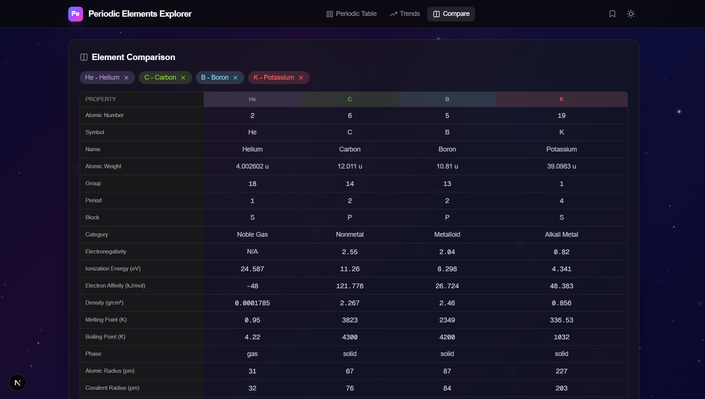

<div align="center">

# ⚛️ Periodic Elements Explorer

**An interactive, 3D periodic table of all 118 elements built with Next.js**

[](https://nextjs.org)
[](https://react.dev)
[](https://www.typescriptlang.org)
[](https://tailwindcss.com)
[](https://threejs.org)
[](https://www.framer.com/motion)

</div>

---

## 🖼️ Overview

<p align="center">
  
</p>

The **Periodic Elements Explorer** brings the periodic table to life with interactive 3D atomic models, smart search, element comparison, periodic trends heatmaps, and more.

---

## ✨ Features

<p align="center">
  
  <br/>
  <em>Category highlighting — click any class to highlight matching elements</em>
</p>

| Feature | Description |
|---------|-------------|
| 🧬 **118 Elements** | Complete periodic table with lanthanides & actinides |
| 🔬 **3D Atomic Models** | Interactive Three.js nucleus (protons/neutrons) with orbiting electrons |
| 🔍 **Smart Search** | Search by name, symbol, or atomic number; filter by group, period, category, phase, block |
| 📊 **Element Comparison** | Side-by-side comparison of 2–4 elements across 18+ properties |
| 📈 **Periodic Trends** | Heatmap visualizations for atomic radius, electronegativity, ionization energy, density, melting point |
| 🌓 **Dark / Light Mode** | Space-themed dark mode with animated starfield background |
| ⭐ **Bookmarks** | Save favorite elements to localStorage |
| 📄 **PDF Export** | Export element details as PDF via jsPDF |
| 📱 **Responsive** | Full support for desktop, tablet, and mobile |
| 📦 **PWA Ready** | Manifest.json + icons for progressive web app |

---

## 🎯 Element Spotlight

<p align="center">
  
  <br/>
  <em>Detailed element view with 3D atomic model and comprehensive data</em>
</p>

Every element includes:

- **Atomic:** number, symbol, name, atomic mass, electron configuration, oxidation states
- **Physical:** density, melting/boiling point, phase, thermal conductivity, heat capacity
- **Atomic:** electronegativity, electron affinity, ionization energy, atomic/covalent/ionic/van der Waals radii
- **Crystal:** crystal structure type & parameters, magnetic properties, band structure
- **Mechanical:** Young's modulus, bulk modulus, hardness
- **Isotopes:** mass numbers, abundances, half-lives, decay modes
- **History:** discoverer, year discovered, name origin
- **Chemistry:** common compounds, industrial applications
- **Safety:** hazards, safety information
- **Abundance:** in Earth's crust and the universe
- **Fun Facts:** 5 interesting facts per element

---

## 🔬 3D Atomic Model

<p align="center">
  
  <br/>
  <em>Interactive 3D model — freely rotatable with fullscreen mode</em>
</p>

The atomic model renders each atom as:

- **Nucleus:** Individual proton (red) and neutron (blue) spheres packed in a compact cluster, scaled by `Math.cbrt(mass)`
- **Electrons:** Yellow/gold spheres orbiting on multiple tilted orbital planes (15°, 40°, 65°, etc.)
- **Orbit rings:** Semi-transparent double rings per shell showing orbital paths
- **Interaction:** Freely rotatable with mouse via OrbitControls, auto-rotation with damping

---

## 📊 Element Comparison

<p align="center">
  
  <br/>
  <em>Side-by-side comparison of up to 4 elements across dozens of properties</em>
</p>

Compare 2–4 elements side by side across 18+ properties including physical, atomic, crystal, mechanical, and historical data.

---

## 🔬 Periodic Trends

Visualize 5 trends across the entire periodic table with color heatmaps:

| Trend | Unit | Range |
|-------|------|-------|
| Atomic Radius | pm | 31 – 260 |
| Electronegativity | Pauling | 0.7 – 4.0 |
| Ionization Energy | eV | 3.89 – 24.59 |
| Density | g/cm³ | 0.00009 – 22.59 |
| Melting Point | K | 0.95 – 3823 |

---

## 🛠️ Tech Stack

| Technology | Purpose |
|------------|---------|
| **Next.js 16** | React framework with Turbopack |
| **React 19** | UI library |
| **TypeScript** | Type safety |
| **Tailwind CSS v4** | Utility-first styling |
| **Three.js** / **@react-three/fiber** | 3D atomic models with orbit controls |
| **Framer Motion** | Animations & transitions |
| **jsPDF** | Native PDF export (no html2canvas) |
| **React Icons** | Icon library |

---

## 🚀 Getting Started

```bash
# Clone the repository
git clone https://github.com/Priyanshu-chem/periodic-elements-explorer

# Navigate to the project
cd periodic-elements-explorer

# Install dependencies
npm install

# Start the development server
npm run dev
```

Open [**http://localhost:3000**](http://localhost:3000) in your browser.

## 🏗️ Build

```bash
npm run build
npm start
```

## 📁 Project Structure

```
src/
├── app/
│   ├── globals.css          # Tailwind + custom scrollbars
│   ├── layout.tsx           # Root layout with providers
│   └── page.tsx             # Main app page
├── components/
│   ├── 3d/
│   │   └── AtomicModel3D.tsx # Three.js atomic model
│   ├── ElementBackground.tsx # Per-element animated backgrounds
│   ├── ElementBlock.tsx      # Grid element block
│   ├── ElementComparison.tsx # Side-by-side comparison
│   ├── ElementDetail.tsx     # Element detail panel
│   ├── ElectronShell.tsx     # Canvas electron shells
│   ├── PeriodicTable.tsx     # 18-column grid table
│   ├── PeriodicTrends.tsx    # Heatmap trends
│   ├── SearchBar.tsx         # Search & filters
│   ├── SpaceBackground.tsx   # Animated space backdrop
│   └── ThemeToggle.tsx       # Dark/light toggle
├── context/
│   ├── BookmarkContext.tsx   # Bookmark state
│   └── ThemeContext.tsx      # Theme state
├── data/
│   ├── categories.ts        # Category colors & labels
│   └── elements.ts          # All 118 elements (7156 lines)
├── types/
│   └── index.ts             # TypeScript interfaces
└── utils/
    ├── cn.ts                # Class name utility
    └── pdfExport.ts         # PDF generation
```

---

## 🤝 Contributing

Contributions are welcome! Feel free to open issues or submit pull requests.

## 📄 License

MIT
